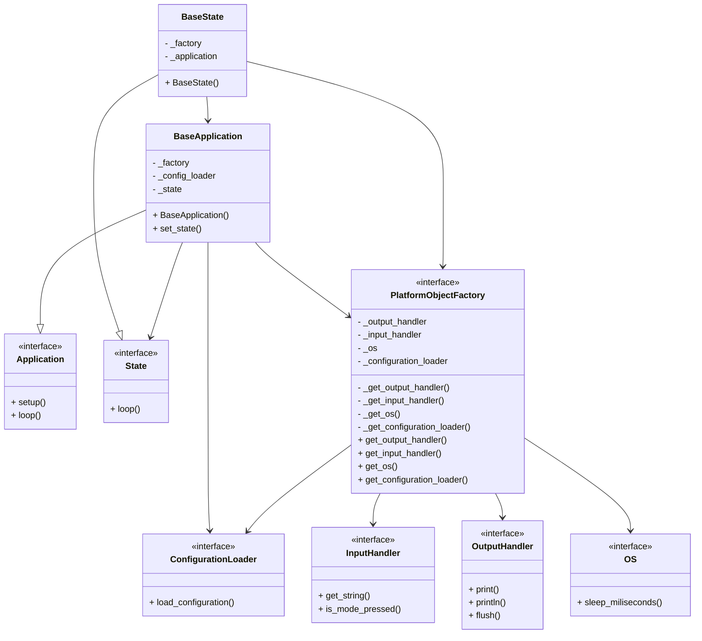

# Class Diagram

```mermaid
---
title Class Diagram
---
classDiagram
    
    class Application {
        <<interface>>
        + setup()
        + loop()
    }

    class BaseApplication {
        - _factory
        - _config_loader
        - _state
        + BaseApplication()
        + set_state()
    }

    BaseApplication --|> Application

    class State {
        <<interface>>
        + loop()
    }

    class BaseState {
        - _factory
        - _application
        + BaseState()
    }

    class ConfigurationLoader {
        <<interface>>
        + load_configuration()
    }

    BaseState --|> State
    BaseApplication --> State
    BaseApplication --> ConfigurationLoader
    BaseState --> BaseApplication

    class PlatformObjectFactory {
        <<interface>>
        - _output_handler
        - _input_handler
        - _os
        - _configuration_loader
        - _get_output_handler()
        - _get_input_handler()
        - _get_os()
        - _get_configuration_loader()
        + get_output_handler()
        + get_input_handler()
        + get_os()
        + get_configuration_loader()
    }

    class InputHandler {
        <<interface>>
        + get_string()
        + is_mode_pressed()
    }

    class OutputHandler {
        <<interface>>
        + print()
        + println()
        + flush()
    }

    class OS {
        <<interface>>
        + sleep_miliseconds()
    }

    BaseApplication --> PlatformObjectFactory
    BaseState --> PlatformObjectFactory
    PlatformObjectFactory --> ConfigurationLoader
    PlatformObjectFactory --> InputHandler
    PlatformObjectFactory --> OutputHandler
    PlatformObjectFactory --> OS
```